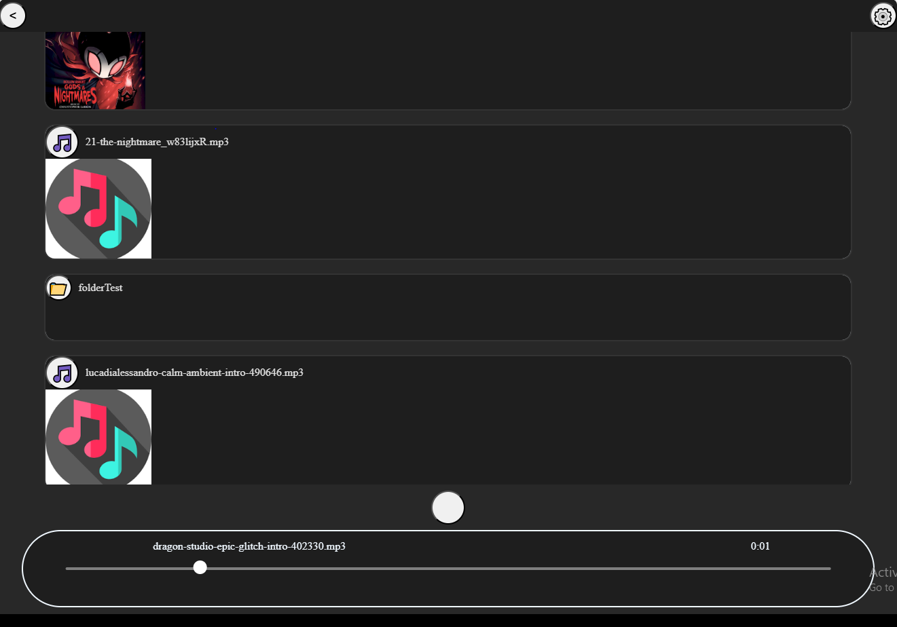
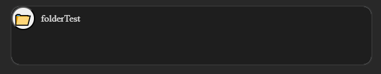
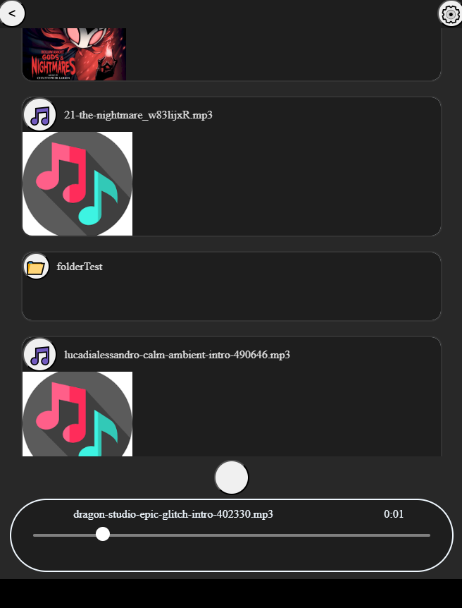

# mfmusic  
###### mfmusic v2.0.0 is a web based music player that runs via the python server `server.py`

it supports mp3 _or any other files that browser can play_ 

###### it support orgnising via folders 

###### works with touch and android devices

TODOs:
add sitting and the ability to link to other folders relative or absolute
add better notification on phones
add a slidable main page for looking at your music as much as you want 
add airpods and heaphones events

